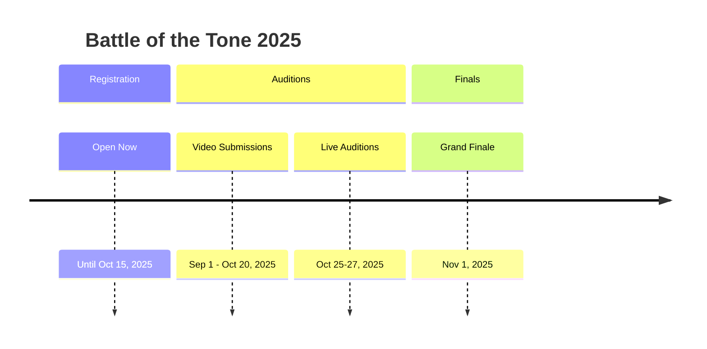

# Battle of the Tone 🎵
### **Make Your Voice Heard!**


## 🎸 About the Competition
**Battle of the Tone** is the premier high school music competition that brings together the most talented young musicians across the region. Whether you're a solo artist or part of a band, this is your platform to showcase your talent and compete for amazing prizes!

## 🏆 Prize Pool: $17,500+
| Place | Prize | Additional Benefits |
|-------|-------|-------------------|
| **🥇 1st Place** | $10,000 | Recording studio time + Professional mentorship |
| **🥈 2nd Place** | $5,000 | Music equipment package |
| **🥉 3rd Place** | $2,500 | Music lessons scholarship |
| **🎭 Special Awards** | Various | Best Original Song, Crowd Favorite, Technical Excellence |

## 📅 Competition Timeline


## 🎵 Eligibility Requirements
- ✅ **All high school students** (grades 9-12)
- ✅ **Solo artists & bands** (max 6 members)
- ✅ **All music genres** welcome
- ✅ **Original compositions** or covers accepted
- ✅ **School ID** required for verification

## 🚀 How to Enter

### 1. Register Your Act
```bash
# Quick Registration Steps:
1. Visit www.MusicCamp.com/register
2. Fill out the registration form
3. Upload required documents
4. Receive confirmation email
```

### 2. Prepare Your Audition
- **Soloists:** 1-2 songs (3-5 minutes total)
- **Bands:** 2 songs (6-8 minutes total)
- **Format:** Video submission or live audition

### 3. Competition Rules
```yaml
performance_requirements:
  time_limit: "8 minutes maximum"
  equipment: "Backline provided, bring your own instruments"
  content: "School-appropriate material required"
  originality: "Original songs encouraged but not mandatory"
```

## 🏛️ Venue Information
**Orion Theater**  
*123 Music Avenue, Harmony City, HC 12345*

- State-of-the-art sound system
- Professional lighting
- Capacity: 1,200 audience members
- Backstage amenities for all performers

## 📋 Registration Checklist
- [ ] Completed registration form
- [ ] Performance video/live audition scheduled
- [ ] School ID verification
- [ ] Parental consent form (if under 18)
- [ ] Song list submitted

## 🌐 Connect With Us
- **Website:** [www.MusicCamp.com](http://www.MusicCamp.com)
- **Email:** info@musiccamp.com
- **Phone:** (123) 456-7890
- **Social Media:** [@BattleOfTheTone](https://instagram.com/BattleOfTheTone)

## 🎶 Past Winners
| Year | Winner | School | Prize |
|------|--------|--------|-------|
| 2024 | The Chromatics | Northwood High | $10,000 |
| 2023 | Elena Rodriguez | Westside Arts | $10,000 |
| 2022 | Voltage Rising | Eastview High | $10,000 |

## ❓ Frequently Asked Questions

### 🤔 Who can participate?
All high school students currently enrolled in grades 9-12.

### 🎵 What genres are accepted?
All genres! Rock, pop, jazz, classical, hip-hop, country, and everything in between.

### 💰 Are there any fees?
Registration is completely free for all participants.

### 🎤 What equipment is provided?
Full backline including drums, amps, and keyboards. Bring your own guitars and special instruments.

---

## 📢 Ready to Compete?

<div align="center">

### **🎸 [Register Now](http://www.MusicCamp.com/register)**
### **🎤 [Audition Today](http://www.MusicCamp.com/auditions)**
### **🏆 [View Full Rules](http://www.MusicCamp.com/rules)**

</div>

---

**Don't just play music—make history. Battle of the Tone 2025 awaits!** 🎶

---
*This competition is organized by Music Camp International in partnership with the Orion Theater. All decisions by judges are final.*
